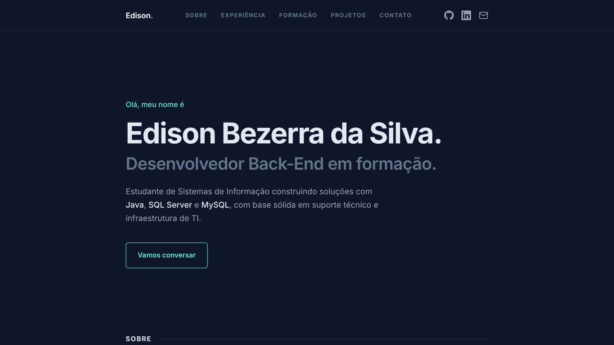
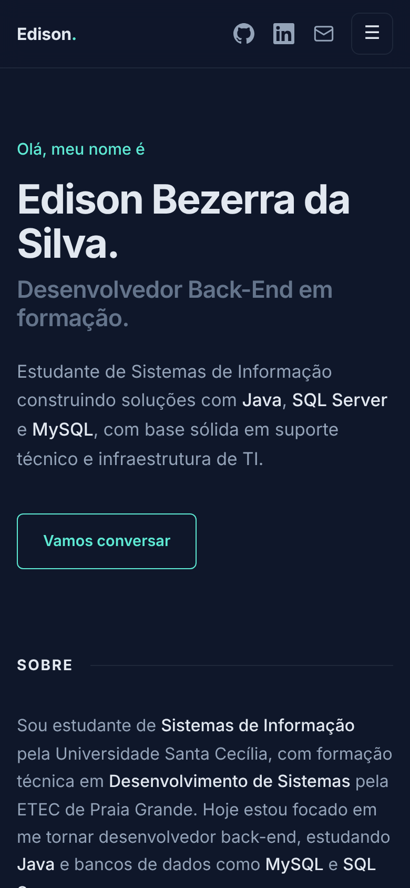

<h1 align="center">Portfólio · Edison Bezerra da Silva</h1>

<p align="center">
  Site pessoal para apresentar minha trajetória, formação e projetos como <strong>desenvolvedor Back-End em formação</strong>.
</p>

<p align="center">
  <a href="https://dazl-max.github.io/portfolio/"><strong>🌐 Ver o site no ar</strong></a>
  ·
  <a href="https://www.linkedin.com/in/edison-bezerra-da-silva-567088346">LinkedIn</a>
  ·
  <a href="mailto:edisonbezerradasilva8@gmail.com">E-mail</a>
</p>

<p align="center">
  
  
  
  
</p>

<p align="center">
  
  
  
</p>

---

## 📸 Prévia

<p align="center">
  
  &nbsp;
  
</p>

## 📑 Sumário

- [Sobre o projeto](#-sobre-o-projeto)
- [Funcionalidades](#-funcionalidades)
- [Tecnologias](#-tecnologias)
- [Estrutura de pastas](#-estrutura-de-pastas)
- [Como rodar localmente](#-como-rodar-localmente)
- [Publicando no GitHub Pages](#-publicando-no-github-pages)
- [Como personalizar](#-como-personalizar)
- [Próximos passos](#-próximos-passos)
- [Sobre mim](#-sobre-mim)
- [Créditos](#-créditos)

## 💡 Sobre o projeto

Este portfólio é uma página única (*single page*) feita com **HTML, CSS e JavaScript puros**, sem frameworks nem etapa de build. Ele reúne em um só lugar:

- **Sobre:** quem sou e meu foco atual em back-end com Java e bancos de dados;
- **Experiência:** minha trajetória profissional em suporte de TI, hardware e operações;
- **Formação:** graduação, curso técnico e certificações;
- **Projetos:** o que já construí, com descrição, tecnologias e imagem;
- **Contato:** um caminho direto para falar comigo.

A ideia foi criar algo leve, rápido e fácil de manter: para atualizar o conteúdo basta editar o `index.html`.

## ✨ Funcionalidades

| Recurso | Descrição |
| --- | --- |
| 📱 **Layout responsivo** | Se adapta a celular, tablet e desktop, sem rolagem horizontal. |
| 🍔 **Menu mobile** | Em telas de até 860px o menu vira um dropdown que fecha ao tocar fora, ao apertar `Esc` ou ao escolher uma seção. |
| 🧭 **Navegação ativa** | O link da seção visível fica destacado conforme você rola a página. |
| 🔦 **Efeito spotlight** | No desktop, uma luz suave acompanha o cursor do mouse. |
| 🃏 **Cards interativos** | Experiências e projetos ganham destaque ao passar o mouse; os efeitos de hover só aparecem em dispositivos com mouse. |
| 🎨 **Tema escuro** | Paleta definida em variáveis CSS (`:root`), fácil de trocar. |
| ♿ **Acessibilidade** | HTML semântico, `aria-label` nos ícones e menu, `aria-expanded` no botão do menu. |
| ⚡ **Zero dependências** | Só a fonte Inter vem do Google Fonts; o resto é código próprio. |

## 🛠 Tecnologias

- **HTML5:** estrutura semântica (`header`, `nav`, `main`, `section`, `footer`)
- **CSS3:** Flexbox, CSS Grid, variáveis CSS, `clamp()` para tipografia fluida e media queries
- **JavaScript (ES6+):** menu mobile, destaque da seção ativa, spotlight e ano automático no rodapé
- **Google Fonts:** fonte [Inter](https://fonts.google.com/specimen/Inter)
- **GitHub Pages:** hospedagem gratuita

## 📂 Estrutura de pastas

```text
portfolio/
├── index.html      # Conteúdo e estrutura da página
├── style.css       # Estilos, tema e regras responsivas
├── script.js       # Interações (menu, seção ativa, spotlight)
├── imgs/           # Favicon e imagens dos projetos
│   └── favicon.svg
└── assets/         # Imagens usadas neste README
    ├── preview-desktop.png
    └── preview-mobile.png
```

## 🚀 Como rodar localmente

Não é preciso instalar nada. Escolha uma das opções:

**1. Abrir direto no navegador**

```bash
git clone https://github.com/dazl-max/portfolio.git
cd portfolio
```

Depois é só abrir o arquivo `index.html` com dois cliques.

**2. Com servidor local (recomendado)**

- **VS Code:** instale a extensão **Live Server**, clique com o botão direito em `index.html` e escolha **Open with Live Server**.
- **Python:** dentro da pasta do projeto, rode:

```bash
  python -m http.server 5500
```

  e acesse <http://localhost:5500>.

## 🌐 Publicando no GitHub Pages

1. Envie os arquivos para o repositório (o `index.html` precisa ficar na raiz).
2. No GitHub, abra **Settings → Pages**.
3. Em **Source**, escolha **Deploy from a branch**.
4. Selecione a branch **main** e a pasta **/ (root)**, depois clique em **Save**.
5. Em alguns minutos o site estará em `https://dazl-max.github.io/portfolio/`.

> 💡 **Dica:** se o repositório se chamar `dazl-max.github.io`, o site fica no endereço principal `https://dazl-max.github.io/`.

## 🎨 Como personalizar

**Cores:** todas ficam no topo do `style.css`:

```css
:root {
  --bg: #0f172a;       /* fundo */
  --text: #94a3b8;     /* texto */
  --heading: #e2e8f0;  /* títulos */
  --accent: #5eead4;   /* cor de destaque */
}
```

**Adicionar um projeto:** copie um bloco `<li>` dentro de `<section id="projetos">` no `index.html` e altere o nome, a descrição, as tags, o link e a imagem:

```html
<li>
  <div class="item proj">
    <div class="hover-bg"></div>
    <div class="body">
      <h3><a class="title" href="LINK_DO_PROJETO">Nome do projeto<span class="arrow">↗</span></a></h3>
      <p>Descrição curta do problema que o projeto resolve.</p>
      <ul class="tags"><li>Java</li><li>MySQL</li></ul>
    </div>
    <div class="proj-thumb"></div>
  </div>
</li>
```

> 💡 **Dica:** evite espaços e acentos nos nomes de imagens (use `fonema-pipo.png` em vez de `Captura de tela...png`). Isso evita links quebrados em alguns servidores.

**Adicionar uma experiência:** o processo é o mesmo, copiando um `<li>` em `<section id="experiencia">` e ajustando o período no `<header class="meta">`.

## 🧩 Próximos passos

- [x] Layout responsivo para celular e tablet
- [x] Menu mobile acessível
- [ ] Adicionar mais projetos com links para os repositórios
- [ ] Incluir seção de habilidades técnicas
- [ ] Versão em inglês
- [ ] Botão para baixar o currículo em PDF

## 👨‍💻 Sobre mim

Sou **Edison Bezerra da Silva**, estudante de **Sistemas de Informação** na Universidade Santa Cecília e técnico em **Desenvolvimento de Sistemas** pela ETEC de Praia Grande. Estou me especializando em **desenvolvimento back-end** com **Java**, **MySQL** e **SQL Server**, e trago experiência prática em suporte técnico e infraestrutura de TI.

Estou aberto a oportunidades de **estágio** e **vagas júnior** em back-end.

<p>
  <a href="https://www.linkedin.com/in/edison-bezerra-da-silva-567088346"></a>
  <a href="mailto:edisonbezerradasilva8@gmail.com"></a>
  <a href="https://github.com/dazl-max"></a>
</p>

## 🙏 Créditos

Layout inspirado no portfólio de [Brittany Chiang](https://brittanychiang.com), adaptado ao meu conteúdo.

---

<p align="center">Feito com ☕ e código por <a href="https://github.com/dazl-max">Edison Bezerra da Silva</a></p>
